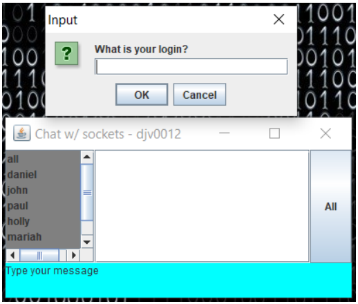
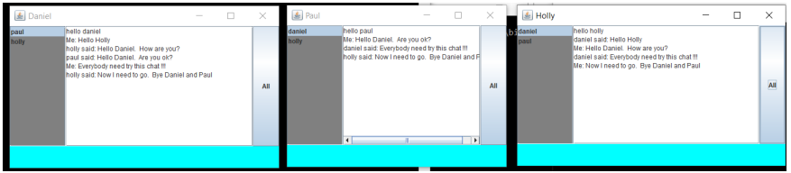
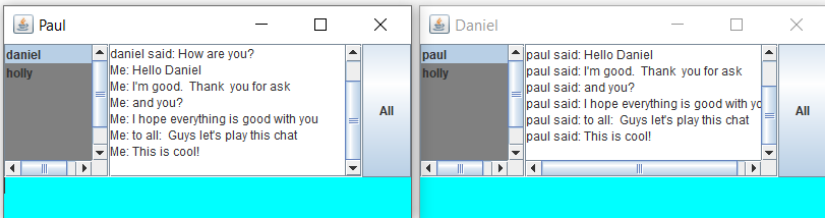
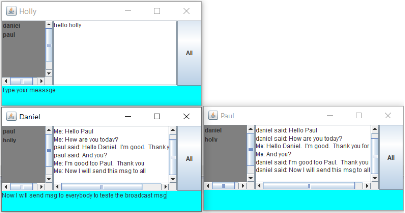
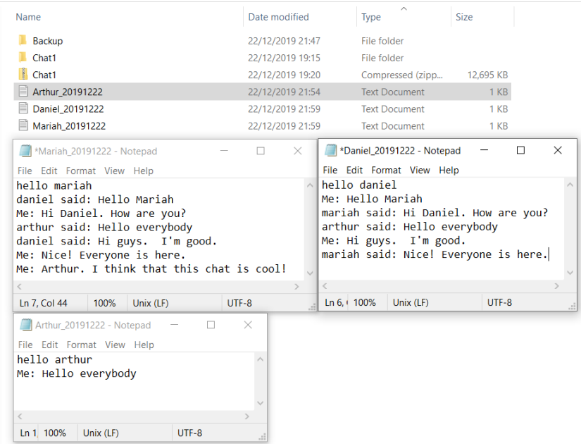

# Chat-sockets-java
 Chat APP - Java-Sockets.

 A multi-user chat using Java language and sockets

* Client /Server
* Text messages
* TCP/IP
* Swing

## Functionalities:
✓ Login

✓ Updated list of users online in the chat room.

✓ Sending private messages (selecting a user from the list and handling exceptions).

✓ Broadcasting messages (sending messages to all list users)

✓ Message History Store (log)

✓ Handling of exceptions.

✓ Button, window, and java. Swing class functionality

✓ Horizontal and vertical scroll features with treatment to automatically scroll down the 
conversation

✓ Removal of the user who logged in from the list to not be chosen or seen and not receive 
message

✓ Client window top bar update with logged in user name

✓ Does not allow user to log in with the same name

Powered by DViga ❤️
 
---
 

## Screenshots of usage examples:

